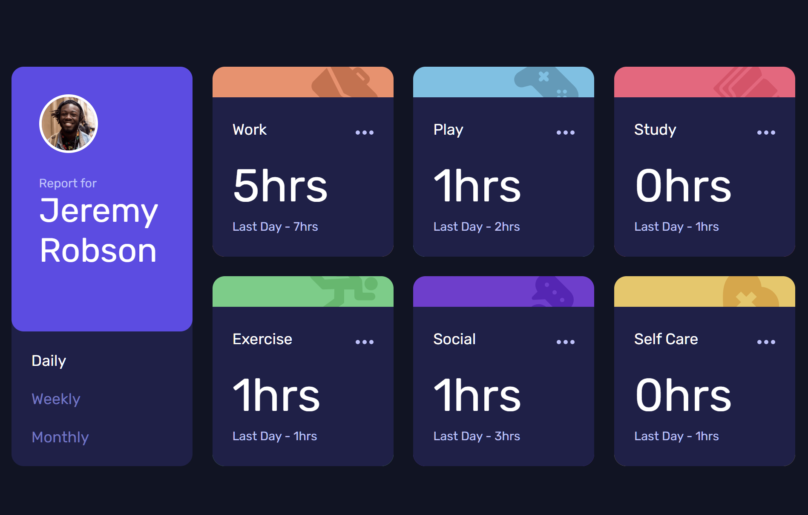

# Frontend Mentor - Time tracking dashboard solution

This is a solution to the [Time tracking dashboard challenge on Frontend Mentor](https://www.frontendmentor.io/challenges/time-tracking-dashboard-UIQ7167Jw). Frontend Mentor challenges help you improve your coding skills by building realistic projects. 

## Table of contents

- [Overview](#overview)
  - [The challenge](#the-challenge)
  - [Screenshot](#screenshot)
  - [Links](#links)
- [My process](#my-process)
  - [Built with](#built-with)
  - [What I learned](#what-i-learned)
- [Author](#author)

## Overview

### The challenge

Users should be able to:

- View the optimal layout for the site depending on their device's screen size
- Switch between viewing Daily, Weekly, and Monthly stats

### Screenshot

### Links

- [Solution URL](https://github.com/anton-zykov/fm-time-tracking-dashboard)
- [Live Site URL](https://anton-zykov.github.io/fm-time-tracking-dashboard/)

## My process

### Built with

- Semantic HTML5 markup
- Pure CSS
- Mobile-first workflow
- Fetch API
- Pure JS class components

### What I learned

For the first time, I utilized vanilla JS (without React) in a project to add interactivity. I also employed classes to dynamically create components based on data acquired with the fetch function.

I have become quite confident in writing HTML and CSS and have only encountered a few situations where I needed to search the web for documentation or assistance. This project was completed in only two evenings, which is much faster than my previous pace.

## Author

- Frontend Mentor - [@anton-zykov](https://www.frontendmentor.io/profile/anton-zykov)
- LinkedIn - [anton-zykov-916a06248](https://www.linkedin.com/in/anton-zykov-916a06248/)
